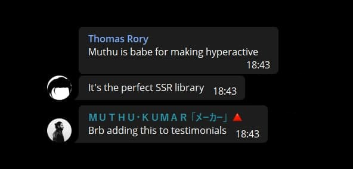

<div align="center">
  
</div>

<div align="center">
<h1>hyperactive</h1>
</div>

Hyperactive is a powerful set of tools to build reactive web applications.

We're currently working on a 2.0 release, which will include fully reactive client-side rendering. To try the latest version, you can get `hyper` from GitHub:

```bash
npm install 'https://gitpkg.vercel.app/feathers-studio/hyperactive/packages/hyper?dev'

yarn add 'https://gitpkg.vercel.app/feathers-studio/hyperactive/packages/hyper?dev'

pnpm add 'https://gitpkg.vercel.app/feathers-studio/hyperactive/packages/hyper?dev'

bun install 'https://gitpkg.vercel.app/feathers-studio/hyperactive/packages/hyper?dev'
```

This is not a release version, so expect some bugs.

<div align="center">
<h2>Usage</h2>
</div>

### On the server

```TypeScript
import { renderHTML } from "@hyperactive/hyper";
import { div, p, h1, br } from "@hyperactive/hyper/elements";

assertEquals(
  renderHTML(
    section(
      { class: "container" },
      div(
        img({ src: "/hero.jpg" }),
        h1("Hello World"),
      ),
    ),
  ),
  `<div class="container"><div><h1>Hello World</h1></div></div>`,
);
```

### In the browser

```TypeScript
import { State, renderDOM } from "@hyperactive/hyper";
import { div, p, button } from "@hyperactive/hyper/elements";

const s = new State(0);

const root = document.getElementById("root");

renderDOM(
  root,
  div(
    p("You clicked ", s, " times"),
    button(
      { on: { click: () => s.update(s.value + 1) } },
      "Increment"
    ),
  ),
);

```

<div align="center">
<h2>Testimonials</h2>
</div>

<div align="center">
  
</div>
