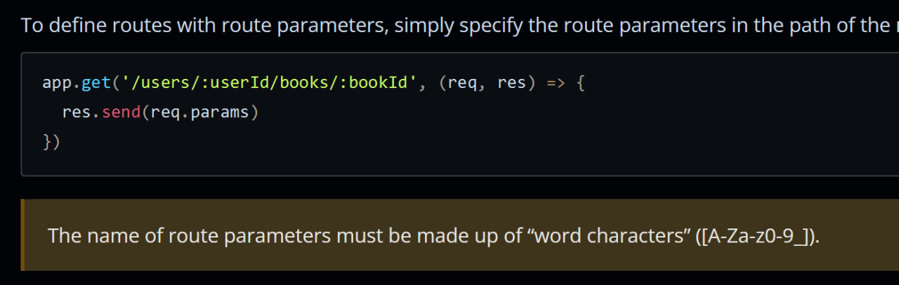

# Designing a spec'd path parser from scratch

> This blog post is a part of a series of blog posts about the design of Hyperserve, a modern server framework being built for JavaScript. It's part of the broader Hyperactive project, a modern suite of web application development tools.

## The problem

To route requests in a web server, we need to parse a "path spec", so to say, which is a string that describes a path with parameters. You may be familiar with this from frameworks like Express. Express allows named parameters (`:param`) and Regex parameters (`?`, `+`, `*`, and `()`) in path specs. Let's start with the most common one.

```ts
app.get("/users/:username", (req, res) => {
	//           「 { username: string } 」
	res.send(`Hello ${req.params.username}`);
	//                    ^^^^^^
});
```

`"/users/:username"` is what I call a path spec. It describes a path that matches the pattern and captures the `username` parameter. If you use TypeScript and have `@types/express` installed, you may have noticed that `req.params` is of type `{ username: string }`. This is because `@types/express` takes advantage of TypeScript's template literal types to model the path spec.

But there's a big problem here.



TypeScript cannot parse the string with these limitations. The union formed by the set of these characters is too large, so TypeScript will give up on recursion. So what does @types/express do? It lies. Instead of parsing accepted characters, it delimits the path spec by the chars `/ . -`. Worse yet, it doesn't even support Regex parameters.

This means that if you have a path spec like `/users/:username`, it will be parsed as `/users/:username` and the `username` parameter will be captured as `username`.

[Zig]
If we had this it would've been possible and easy
Zig can express it at type level
So what does @types/express do? It lies. It'll accept chars not in the allowed set and it's delimited only by the chars / . -
So if you have /:user@:password/ for some ill-advised reason, it'll show types as

params: { "user@:password": string }

and not

{ user: string, password: string }
which runtime Express will give you
There are several other limitations of @types/express, its path parser does not express most of what Express allows
It's not a tradeoff I'm willing to make for Hyperserve, it has to model types accurately. So my parser only delimits by / . -
Some Regex params are supported in Express, but not in @types/express
Okay let's look at the URL spec for paths:
https://datatracker.ietf.org/doc/html/rfc3986#section-3.3
unreserved = ALPHA / DIGIT / "-" / "." / "\_" / "~"

pct-encoded = "%" HEXDIG HEXDIG

sub-delims = "!" / "$" / "&" / "'" / "(" / ")"
/ "\*" / "+" / "," / ";" / "="

pchar = unreserved / pct-encoded / sub-delims / ":" / "@"
So basically

ALPHA | DIGIT | "-" | "." | "\_" | "~" | "!" | "$" | "&" | "'" | "(" | ")" | "\*" | "+" | "," | ";" | "=" | ":" | "@"

Is all the chars allowed in a path segment, along with %HH
